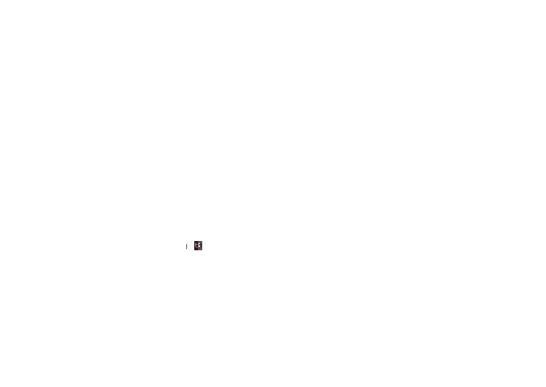

# microGPT (demo)

An interactive terminal presentation that builds, trains, and runs a character-level language model on 32,000 real names, step by step. Every number you see is computed live.

Based on Andrej Karpathy's [microGPT gist](https://gist.github.com/karpathy/8627fe009c40f57531cb18360106ce95) and [blog post](https://karpathy.github.io/2026/02/12/microgpt/): a tiny GPT built from scratch in a single Python file; no PyTorch, no numpy, just scalar math.

# summary

- **Value** — autograd engine (forward + backward in ~50 lines)
- **GPT forward pass** — embeddings, RMSNorm, attention, MLP
- **Training** — cross-entropy loss, Adam optimizer
- **Inference** — temperature-controlled sampling

The entire model is 4,192 parameters and trains in ~10 seconds on a laptop.

## run

```bash
python demo.py
```

Navigate with `Enter` (advance), `+/-` (sub-steps), `r` (resample), `q` (quit).

## requirements

```bash
pip install textual rich
```

Python 3.10+. No other dependencies — the neural network is pure Python.

## slides

1. **Architecture** — tree view of every layer and parameter
2. **Forward Pass** — animated pipeline showing real numbers at each stage
3. **Training** — live loss curve, before/after name generation
4. **Learning** — side-by-side probability distributions before vs after training
5. **Inference** — token-by-token generation with confidence colors
6. **Summary** — scrolling source code + scale comparison to GPT-4

## references

- [microGPT gist](https://gist.github.com/karpathy/8627fe009c40f57531cb18360106ce95) — Andrej Karpathy
- [microGPT blog post](https://karpathy.github.io/2026/02/12/microgpt/) — Andrej Karpathy
